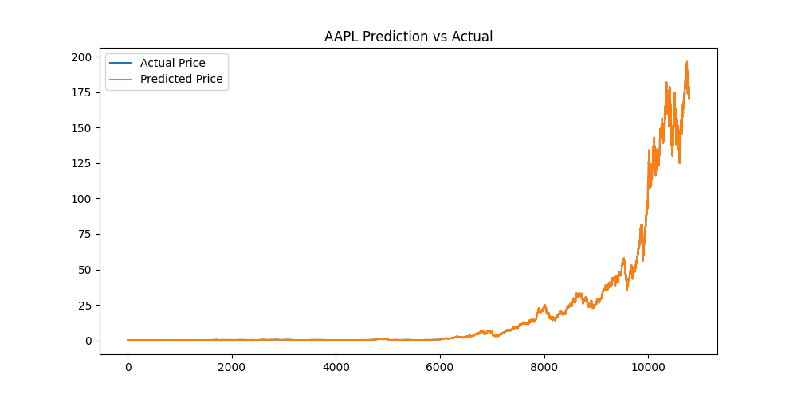
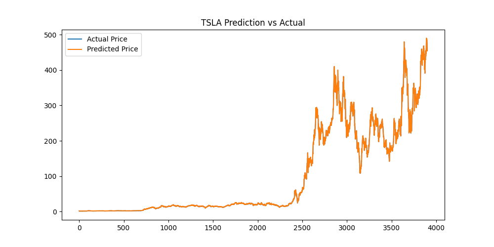

# AI Quant Trading System

This project explores how machine learning can be used in quantitative finance to predict stock prices and simulate trading strategies.

The system combines a **Python-based machine learning pipeline** with a **C++ trading simulation engine** to evaluate trading performance using historical stock market data.

The goal of the project was to build a small research pipeline that demonstrates how predictive models can be integrated into a trading workflow.

---

## Project Overview

The system works in three main stages:

1. Historical stock market data is processed using Python.
2. A machine learning model predicts future stock prices.
3. A C++ trading engine simulates trading decisions using those predictions.

This allows the project to evaluate how predictive models might perform in a simplified trading environment.

---

## System Architecture
Stock Market Data
↓
Machine Learning Model (Python)
↓
Prediction Files (CSV)
↓
Trading Simulation Engine (C++)
↓
Portfolio Performance Evaluation
---

## Features

- Stock price prediction using machine learning
- Multi-stock dataset support
- Automated prediction generation
- C++ trading simulation engine
- Portfolio performance evaluation
- Prediction visualization charts
- Portfolio metrics including Sharpe Ratio

---

## Technologies Used

- Python
- Pandas
- Scikit-Learn
- Matplotlib
- NumPy
- C++
- Git & GitHub

---

## Dataset

The project uses historical stock market data sourced from Kaggle.

Stocks used in this analysis include:

- Apple (AAPL)
- Amazon (AMZN)
- Google (GOOG)
- Microsoft (MSFT)
- Nvidia (NVDA)
- Meta (META)
- Tesla (TSLA)

---

## Project Structure
ai-quant-trading-system

data/ → historical stock datasets
python_al/ → machine learning model
cpp_engine/ → trading simulator
predictions/ → generated prediction files
analysis/ → visualization and portfolio metrics
README.md → project documentation
LICENSE
---

## Running the Project

### Generate Predictions

Run the machine learning model:

python python_al/predictor.py
This generates prediction files inside the predictions folder.
Run Trading Simulation

Compile the C++ trading engine:
g++ cpp_engine/trading_engine.cpp -o trading_engine
Run the trading engine:
trading_engine
Generate Prediction Charts

Run the visualization script:
python analysis/visualize.py
This produces charts comparing predicted prices with actual prices.
Calculate Portfolio Metrics

Run the portfolio analysis script:
python analysis/portfolio_metrics.py
Example output:
Average Return: 0.001347
Volatility: 0.027737
Sharpe Ratio: 0.049
The Sharpe Ratio measures risk-adjusted returns and is widely used in quantitative finance.

Example Prediction Visualization
Apple (AAPL)

Tesla (TSLA)

Workflow

1.Load historical stock market data.

2.Train a machine learning model to predict future prices.

3.Generate prediction files for multiple stocks.

4.Use the C++ trading engine to simulate trades.

5.Evaluate portfolio performance and visualize results.

What I Learned

Working on this project helped me understand:

-applying machine learning to financial time-series data

-building a simple trading simulation pipeline

-combining Python data analysis with C++ systems programming

-structuring a research-style software project

Future Improvements

Possible next steps for the project include:

-using deep learning models such as LSTM for time-series prediction

-implementing portfolio optimization strategies

-adding more financial risk metrics

-integrating real-time market data APIs

-improving the trading strategy logic

License

This project is licensed under the MIT License.
